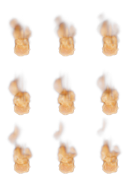
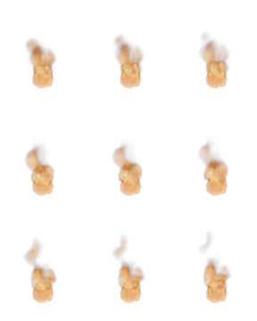
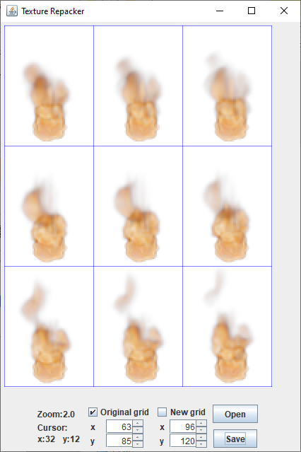

# Texture repacker
Tool to repack images with grid layout to texture pack with another grid size

While developing my <a href="https://github.com/VahanChaMaka/king-of-the-dump">game</a> I picked texture packs from a lot of various sources. Not all of them are packed with the required spacings, so I created this simple tool.

<table>
  <tr>
    <td vlign="center"></td>
    <td vlign="center"></td>
    <td vlign="center"></td>
  </tr>
</table>

# How to use
1. Select image
2. Adjust grid to cut
3. Adjust new desirable grid (bigger than original one so far)
4. Click "Save" button. 
Processed image will be saved in folder "processed" in the original image location with the same name

